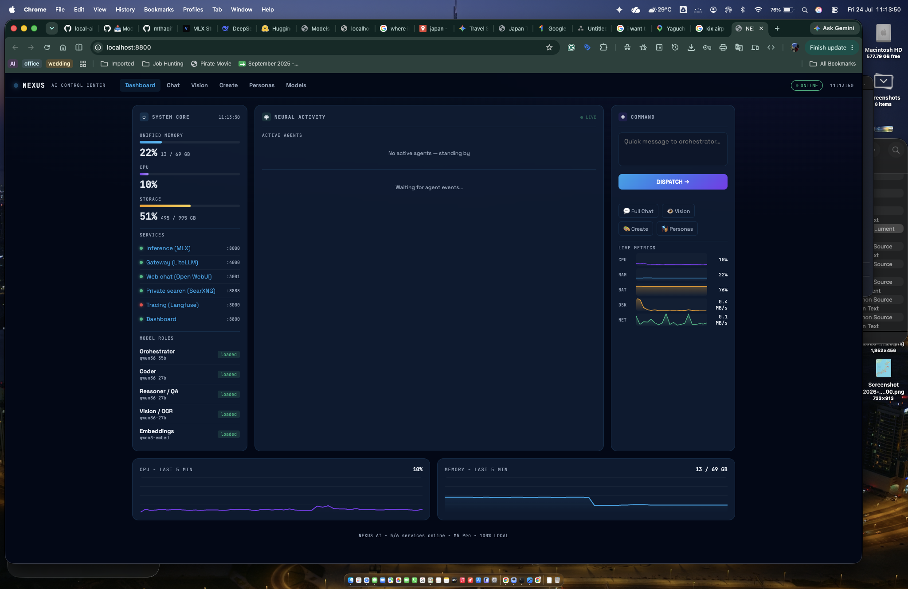
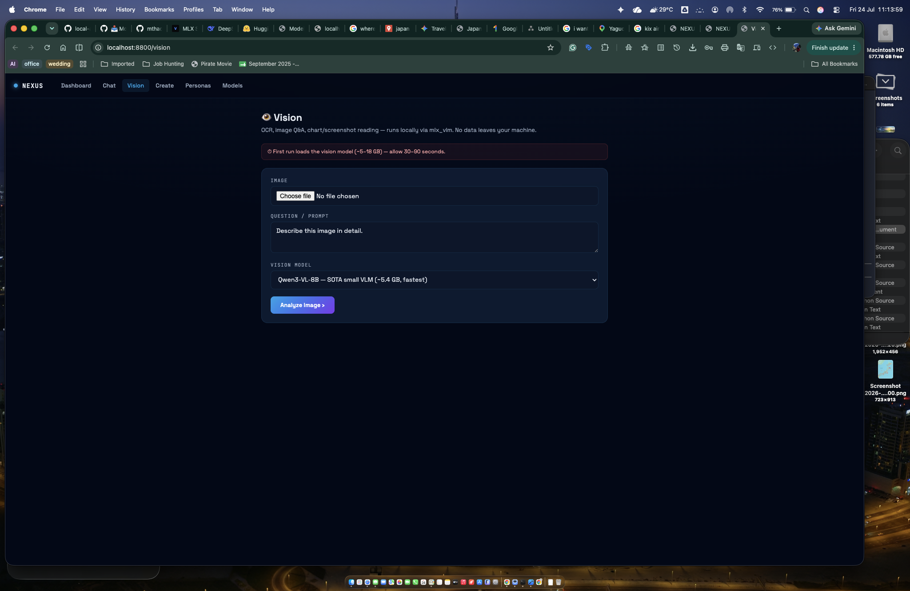

# NEXUS — Local AI Workstation

> 100% local AI stack on Apple Silicon. No API keys, no billing, no data leaving your machine.

A production-grade local AI setup for Apple M-series Macs. One command brings up a multi-agent orchestrator backed by 9 models, a futuristic web dashboard, a Telegram bot, image generation, vision analysis, and full autonomous SDLC capability.

---

## Screenshots

### Main Dashboard


Three-column command center: **System Core** (hardware stats, service health, model roster) · **Neural Activity** (live SSE event feed + active agent tracker) · **Command** (quick dispatch + 5-metric sparklines: CPU, RAM, Battery, Disk I/O, Network).

### Vision Analysis


Drop an image, pick a model from the dropdown (no typos possible), get local OCR / Q&A. No data leaves the machine.

---

## Hardware target

| Component | Spec |
|---|---|
| Chip | Apple M5 Pro (works on M1–M5) |
| RAM | 64 GB unified memory |
| Disk | 1 TB |
| OS | macOS 13+ |

All model sizes listed are peak MLX memory. The **on-demand loader** keeps only one model in RAM at a time, so 64 GB is enough to run the 42 GB coder or 37 GB deep reasoner — just not simultaneously.

---

## Architecture

```
You
 │
 ├── Web Dashboard  :8800  — chat, vision, image gen, live metrics, personas, models
 ├── Telegram Bot          — mobile-first, live thought bubbles, approval buttons
 └── CLI: mlx-agent        — terminal REPL, batch tasks, autonomous SDLC

         ↓ OpenAI-compatible API calls

   LiteLLM Gateway  :4000  — role aliases (coder:, writer:, reasoner:…)
         ↓
   mlx-openai-server  :8000  — on-demand model loader, Apple Metal GPU
         ↓
   9 local models in HuggingFace cache (~280 GB total, all quantized)
```

### Sequential multi-agent SDLC

The orchestrator (Qwen3.6-35B MoE) **plans then delegates one subagent at a time**. Each specialist loads, runs its task, then unloads before the next one loads. This allows models that individually exceed available RAM.

```
User: "build a wordcount CLI: code + tests + README"
  → Orchestrator plans  (Qwen3.6-35B,  ~20 GB loaded)
  → unloads
  → Coder writes code   (Qwen3-Coder-Next 80B, ~42 GB)
  → unloads
  → QA writes tests     (Qwen3.6-27B,  ~28 GB)
  → unloads
  → Writer writes docs  (Qwen3.6-27B)
  → Orchestrator reports back
```

Every agent step streams to the dashboard's **Neural Activity** feed via SSE (`activity/events.jsonl`). You watch the pipeline execute in real time.

---

## Model roster

| Role | Model | Size | Notes |
|---|---|---|---|
| Orchestrator / Researcher / BA | unsloth/Qwen3.6-35B-A3B MoE | ~20 GB | 3.3B active params, tool calls, CoT |
| Writer / QA | mlx-community/Qwen3.6-27B 8-bit | ~28 GB | Dense, stable long output |
| Fast Reasoner | mlx-community/DeepSeek-R1-Distill-Qwen-32B | ~18 GB | `<think>` CoT, MIT license |
| Deep Reasoner | mlx-community/DeepSeek-R1-Distill-Llama-70B | ~37 GB | Best for hard math / planning |
| Best Coder | mlx-community/Qwen3-Coder-Next (80B MoE) | ~42 GB | SWE-Bench #1, tool calls |
| RAG Embeddings | mlx-community/Qwen3-Embedding-8B | ~5 GB | Vector search |
| Vision / OCR | mlx-community/Qwen3-VL-8B | ~5.4 GB | SOTA small VLM |
| Design / Vision | mlx-community/Gemma-4-12B | ~10 GB | Google Gemma 4 |
| General Purpose | mlx-community/Gemma-4-31B | ~18 GB | Google Gemma 4, larger |
| **Image Gen** | Tongyi-MAI/Z-Image-Turbo (mflux) | ~32.8 GB | Non-gated, ~15 s/512 px |

All LLMs served with `on_demand: true`, `kv_bits: 8` (halved KV-cache), per-model context windows.

---

## Anti-hallucination config

Precision-first parameters applied to every model call:

| Parameter | Value | Effect |
|---|---|---|
| `temperature` | 0.1 | Near-deterministic output |
| `frequency_penalty` | 0.6 | Suppresses repetition loops |
| `min_p` | 0.05 | Filters low-probability tokens |

Per-model temperature overrides are applied where needed (e.g. embeddings → 0.0).

---

## Services

| Service | Port | Purpose |
|---|---|---|
| mlx-openai-server | 8000 | Apple Metal inference, OpenAI API |
| LiteLLM Gateway | 4000 | Role-alias routing, drop-in OpenAI proxy |
| NEXUS Dashboard | 8800 | Full web UI |
| Open WebUI | 3001 | Alternative chat frontend |
| SearXNG | 8888 | Private web search for agent RAG |
| Langfuse | 3000 | Optional tracing / observability |

All services managed by **launchd** — start at login, auto-restart on failure.

---

## Setup

### Prerequisites

- macOS 13+ on Apple Silicon (M1–M5)
- Xcode CLT: `xcode-select --install`
- Homebrew: `brew.sh`
- `uv`: `brew install uv`

### Bootstrap

```bash
git clone <this-repo>
cd local-ai-workstation
chmod +x mlx-setup.sh
./mlx-setup.sh --bootstrap
```

This installs the Python venv, all dependencies, downloads core models, writes all configs, and registers launchd services. Everything auto-starts from this point on.

### Configure secrets

```bash
./mlx-setup.sh --configure
```

Prompts for `DASHBOARD_PASSWORD`, `TELEGRAM_BOT_TOKEN`, and `TELEGRAM_USER_ID`. Stored in `~/.mlx-ai-workstation/.env` (never committed).

### Pull heavy models (optional, ~79 GB extra)

```bash
./mlx-setup.sh --pull-heavy   # Qwen3-Coder-Next 80B + DeepSeek-R1-70B
```

---

## Usage

### Web Dashboard — `http://localhost:8800`

| Page | What it does |
|---|---|
| **Dashboard** | Live CPU/RAM/Battery/Disk/Net sparklines, service health, active agent tracker, SSE neural feed, quick dispatch |
| **Chat** | Full-screen chat — Agent mode (tool-calling agent with thinking panel) or Direct mode (raw model) |
| **Vision** | Upload image → pick model from dropdown → local OCR / image Q&A |
| **Create** | Text-to-image with Z-Image Turbo, step/size controls, gallery |
| **Personas** | Create / edit agent personas (model + system prompt + tool permissions) |
| **Models** | Search HuggingFace, download, probe-load, register new models |

The top navigation is **sticky on all pages** — always one click away from any section.

### CLI agent

```bash
# Ask orchestrator a question
mlx-agent "how much disk is free on this laptop?"

# Use a specific specialist
mlx-agent --persona coder "write a binary search tree in Python"
mlx-agent --persona researcher "what are the best MLX models in 2026?"

# Interactive REPL
mlx-agent

# Full autonomous SDLC task
mlx-agent --persona orchestrator --yes "
  Build a Python CLI for parsing nginx access logs.
  Have coder write it, QA write tests, writer write README.
  Save everything to ~/Projects/nginx-parser/.
"
```

### Telegram bot

After `./mlx-setup.sh --configure`, the bot starts automatically at login.

```
/help          — show commands
/personas      — list available agents
/use coder     — switch to coder persona
/reset         — clear conversation history

Any other text → dispatched to the current persona

While working:
  🧠 orchestrator working… ⠙ 12s     ← live spinner
  ▸ tool: run_shell                    ← tool call trace
  Loading model… (45s)                 ← cold-start indicator
  [Yes] [No] [Allow all]               ← approval buttons
```

### Image generation

```bash
# Via the wrapper script (routes to correct mflux command automatically)
~/.mlx-ai-workstation/mlx-image.sh "a glowing robot in a neon city, cinematic"

# Custom settings
~/.mlx-ai-workstation/mlx-image.sh "PROMPT" out.png z-image-turbo 9 1024 1024

# Or use the Create page in the dashboard
```

---

## Project layout

```
local-ai-workstation/
├── mlx-setup.sh           ← single installer / manager (bootstrap, start, stop, status…)
├── mlx-agent.py           ← persona-aware tool-executor with spawn_subagent
├── mlx-telegram.py        ← Telegram bot bridge with live message updates
├── mlx-image.sh           ← image generation wrapper (mflux command routing)
├── dashboard/
│   └── app.py             ← Flask dashboard — backend API + all 6 HTML pages
└── screenshots/

~/.mlx-ai-workstation/     ← runtime workdir (never committed)
├── .env                   ← secrets
├── mlx-server.config.yaml ← 9-model MLX server config
├── litellm.config.yaml    ← role aliases + gateway settings
├── personas.json          ← agent persona registry
├── activity/
│   └── events.jsonl       ← append-only SSE source for live dashboard feed
├── agent/
├── dashboard/
└── logs/
```

---

## Agent tools

| Tool | What it does |
|---|---|
| `run_shell` | Execute shell commands (safe ones auto-run; others ask) |
| `read_file` | Read any file on disk |
| `write_file` | Write a file (confirms path) |
| `web_search` | Search via local SearXNG |
| `web_fetch` | Fetch a URL and extract text |
| `list_directory` | List a directory |
| `run_python` | Execute Python code |
| `spawn_subagent` | Delegate to a specialist persona (sequential) |
| `download_model` | Pull a new model from HuggingFace |
| `broadcast_event` | Emit an event to the dashboard SSE feed |

`spawn_subagent` is the key tool for SDLC — each call fully loads a different model, runs the task, unloads, and returns the result to the orchestrator.

---

## LiteLLM role aliases

Any OpenAI-compatible client can route by role instead of model name:

```
orchestrator    researcher    ba
coder           dev
writer          qa
reasoner        deep-reasoner
vision          designer
embed
# bare model names also work: qwen36-35b, deepseek-r1-32b, etc.
```

---

## Management commands

```bash
./mlx-setup.sh --start             # start all services
./mlx-setup.sh --stop              # stop all services
./mlx-setup.sh --restart           # restart all
./mlx-setup.sh --status            # health check

./mlx-setup.sh --pull-core         # download core models
./mlx-setup.sh --pull-heavy        # download coder 80B + reasoner 70B
./mlx-setup.sh --add-model <repo> <role> <type>

./mlx-setup.sh --image "prompt"    # generate an image
./mlx-setup.sh --configure         # set secrets
./mlx-setup.sh --telegram          # start Telegram bot in foreground
./mlx-setup.sh --bootstrap         # full reinstall (keeps model cache)
```

---

## Troubleshooting

**Dashboard not loading**
```bash
tail -50 ~/.mlx-ai-workstation/logs/dashboard.log
launchctl kickstart -k gui/$(id -u)/com.mlx.dashboard
```

**MLX server not responding**
```bash
tail -50 ~/.mlx-ai-workstation/logs/mlx-inference.log
launchctl kickstart -k gui/$(id -u)/com.mlx.inference
```

**Model cold-start is slow (30–90 s)**
This is normal — the first inference after an idle period reloads from disk. On-demand idle timeout is 600 s for core models, 300 s for heavy/vision. The Telegram bot and dashboard both show a live "Loading model…" indicator during this time.

**RAM pressure with large models**
Only one large model loads at a time. If you trigger two simultaneously (CLI + dashboard), they compete. The sequential subagent design prevents this during SDLC pipelines. For interactive use, close one session before starting another.

**Telegram bot not responding**
```bash
launchctl list | grep telegram
tail -50 ~/.mlx-ai-workstation/logs/mlx-telegram.log
curl -s https://api.telegram.org   # network check
```

---

## Model licenses

| Model family | License |
|---|---|
| Qwen (all) | Apache 2.0 |
| DeepSeek-R1 Distill | MIT |
| Gemma-4 | Google Gemma Terms of Use |
| Z-Image Turbo | Tongyi Qianwen License (commercial OK) |

This setup code: **MIT**.
