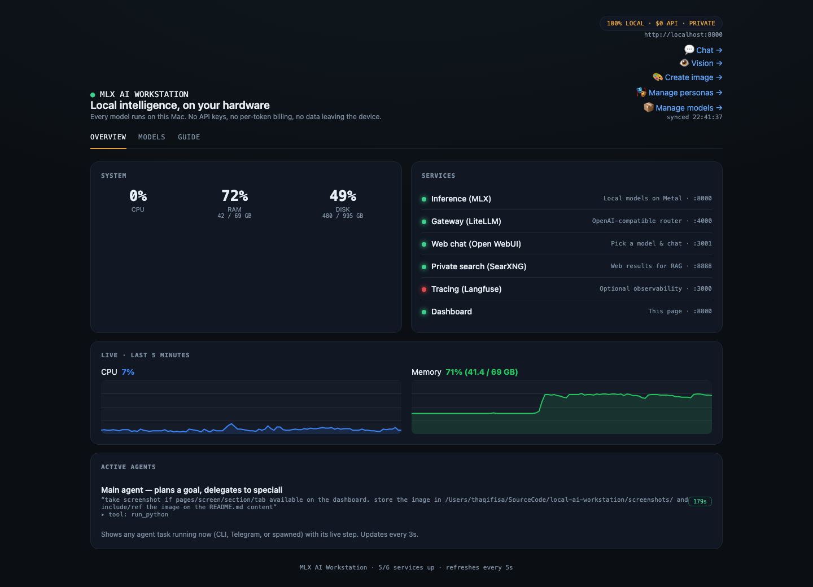
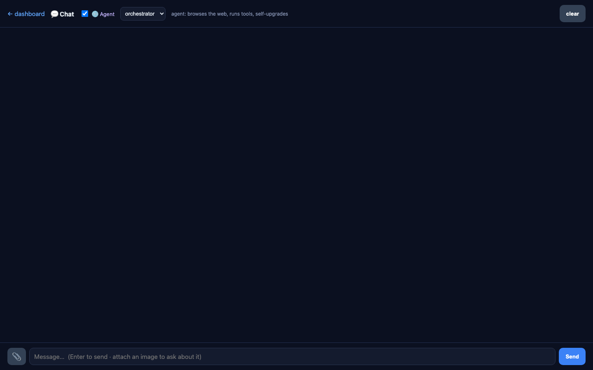
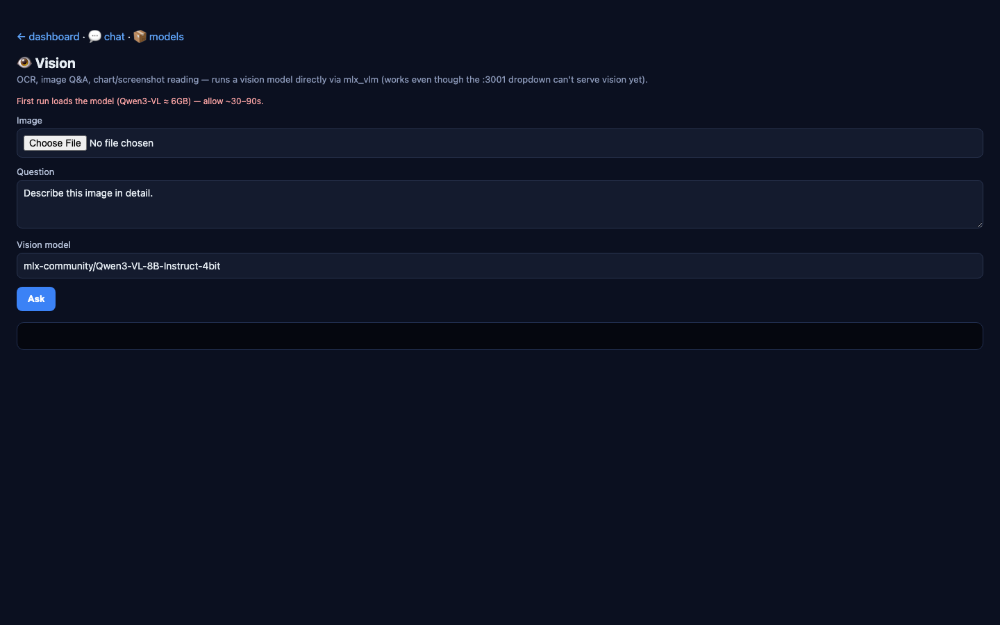
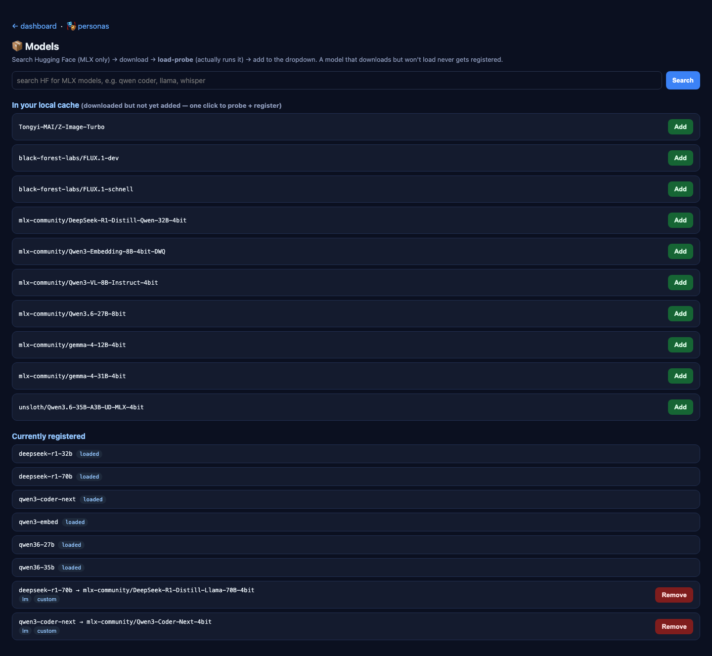
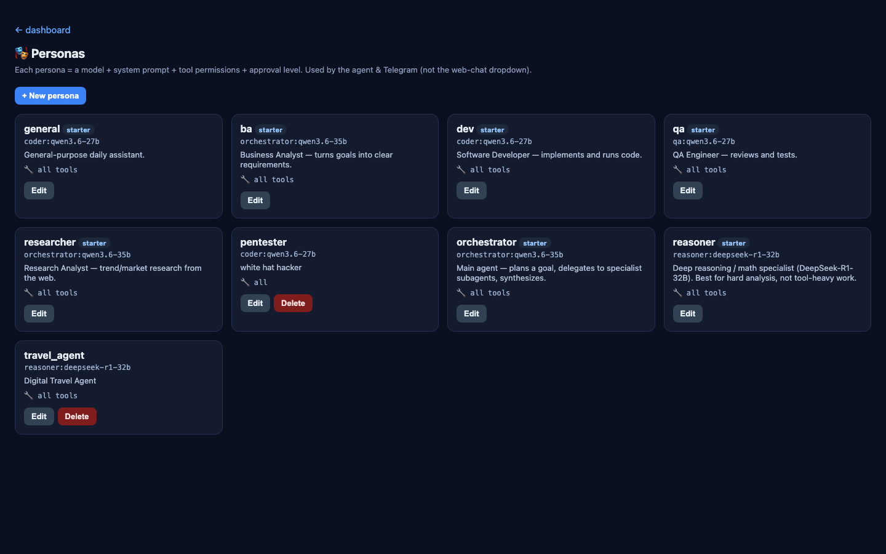
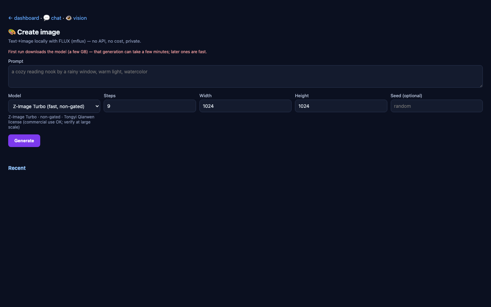

# Local MLX AI Workstation

A fully local, zero-API-cost AI platform running natively on Apple Silicon Macs. No cloud dependencies, no per-token fees — everything runs on-device using Apple's MLX framework and Metal GPU acceleration.

## Architecture

The stack is split into **native host services** (MLX inference) and **Docker containers** (stateless UIs):

```
┌─────────────────────────────────────────────────────────────┐
│  HOST (native, Metal GPU, uv venv + launchd)                │
│                                                             │
│  mlx-openai-server  :8000   MLX inference (LM + vision)    │
│  LiteLLM gateway    :4000   OpenAI-compatible router       │
│  Control dashboard  :8800   Live status + demo + docs      │
│  mflux              CLI     Isolated image generation       │
│                                                             │
│  mlx-agent.py         Persona-aware tool-executor           │
│  mlx-telegram.py      Telegram bridge                       │
└──────────────────────────┬──────────────────────────────────┘
                           │ host.docker.internal
┌──────────────────────────▼──────────────────────────────────┐
│  DOCKER (via Colima; Linux VM)                              │
│                                                             │
│  Open WebUI       :3001   Web chat, pick any model          │
│  SearXNG          :8888   Private web search (RAG)          │
│  Langfuse         :3000   Tracing & observability (opt.)    │
└─────────────────────────────────────────────────────────────┘
```

**Why this split:** Docker on macOS runs a Linux VM with no Metal access, so all MLX inference must run natively. Stateless UIs live in Docker.

## Screenshots

### Control Dashboard


### Chat Page


### Vision Page


### Models Page


### Personas Page


### Imagine Page (Image Generation)


## What's in This Repo

| File | Purpose |
|------|---------|
| `mlx-setup.sh` | Bootstrap script — installs venv, configures launchd, pulls models, starts all services |
| `mlx-agent.py` | Persona-aware tool-executor — the core AI agent that runs natively on the host |
| `mlx-telegram.py` | Telegram bridge — puts the agent in your pocket with inline-button approvals |
| `pre-mlx-cleanup.sh` | Teardown script — removes the old Ollama/OpenClaw stack for a clean slate |
| `.gitignore` | Git ignore rules |
| `screenshots/` | Dashboard and UI screenshots |

## Quick Start

### 1. Bootstrap

```bash
chmod +x mlx-setup.sh
./mlx-setup.sh --bootstrap
```

This provisions:
- A Python 3.12 virtual environment in `~/.mlx-ai-workstation/.venv`
- MLX models downloaded from Hugging Face
- Launchd services for all host-side components
- Docker containers for Open WebUI, SearXNG, and optional Langfuse

### 2. Manage Services

```bash
./mlx-setup.sh --start      # Start all services
./mlx-setup.sh --stop       # Stop all services
./mlx-setup.sh --restart    # Restart all services
./mlx-setup.sh --status     # Check health of all services
```

### 3. Pull Models

```bash
./mlx-setup.sh --pull-models    # Download all CORE models (~72 GB)
./mlx-setup.sh --pull-heavy     # Download OPT models (~83 GB extra)
```

### 4. Run the Agent

```bash
# Default persona (general)
~/.mlx-ai-workstation/.venv/bin/python mlx-agent.py "how much disk is free?"

# Specific persona
~/.mlx-ai-workstation/.venv/bin/python mlx-agent.py --persona researcher "what to build next?"

# List available personas
~/.mlx-ai-workstation/.venv/bin/python mlx-agent.py --list-personas

# Interactive REPL
~/.mlx-ai-workstation/.venv/bin/python mlx-agent.py

# Add/edit/remove personas
~/.mlx-ai-workstation/.venv/bin/python mlx-agent.py --add-persona
~/.mlx-ai-workstation/.venv/bin/python mlx-agent.py --edit-persona pentester
~/.mlx-ai-workstation/.venv/bin/python mlx-agent.py --remove-persona pentester
```

### 5. Telegram Bridge

```bash
./mlx-setup.sh --configure    # Set TELEGRAM_BOT_TOKEN and TELEGRAM_USER_ID
./mlx-setup.sh --telegram     # Start the Telegram bridge
```

## Service Details

### mlx-openai-server (`:8000`)
MLX-powered OpenAI-compatible inference server. Supports:
- **Text generation** — all MLX-compatible LLMs
- **Vision** — Qwen2.5-VL and other vision-capable models
- **Streaming** — SSE-compatible streaming responses

### LiteLLM Gateway (`:4000`)
Router that normalizes all model calls to the OpenAI API format. Connects to:
- Local MLX server (`http://host.docker.internal:8000`)
- External providers (OpenAI, Anthropic, etc.) for fallback

### Control Dashboard (`:8800`)
Live status dashboard showing:
- Service health and uptime
- Model information and VRAM usage
- Quick demo prompts
- Documentation links

### mflux
Isolated image generation CLI using Flux models. Runs in its own environment to avoid dependency conflicts.

## Personas

The agent supports multiple personas, each with different system prompts and tool sets:

| Persona | Description |
|---------|-------------|
| `general` | Default assistant — general-purpose tasks |
| `researcher` | Web search, trend analysis, competitive intelligence |
| `developer` | Code generation, debugging, architecture advice |
| `qa` | Testing strategies, test generation, quality assurance |
| `ba` | Business analysis, requirements gathering, documentation |
| `reasoner` | Deep reasoning, complex problem decomposition |

Personas are defined in `~/.mlx-ai-workstation/personas/` as YAML files.

## Docker Services

| Service | Port | Purpose |
|---------|------|---------|
| Open WebUI | :3001 | Web-based chat interface |
| SearXNG | :8888 | Private, privacy-respecting web search |
| Langfuse | :3000 | AI observability and tracing (optional) |

All Docker services run via Colima (containerd backend).

## Troubleshooting

### Services not starting
```bash
./mlx-setup.sh --status    # Check health
./mlx-setup.sh --restart   # Restart everything
```

### Model download fails
```bash
./mlx-setup.sh --pull-models    # Retry download
```

### Port conflicts
Check for existing services:
```bash
lsof -i :8000   # mlx-openai-server
lsof -i :4000   # LiteLLM
lsof -i :8800   # Dashboard
```

### Docker not running
```bash
colima start
```

## References

- [MLX Documentation](https://ml-explore.github.io/mlx/)
- [Open WebUI](https://github.com/open-webui/open-webui)
- [SearXNG](https://github.com/searxng/searxng)
- [LiteLLM](https://github.com/BerriAI/litellm)
- [Colima](https://github.com/abiosoft/colima)